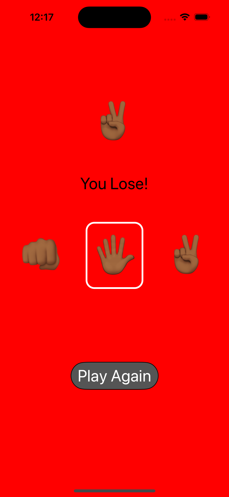

# RPS

<kbd></kbd> <kbd></kbd> <kbd></kbd> <kbd></kbd>

A traditional game of rock, paper, scissors.

## Description

An iOS game that allows users to select an option between rock, paper, or scissors. The user’s opponent is a computer that randomly selects an option as well. Depending on the selection, if a user wins, loses or ties, the user interface will update accordingly.

## Getting Started

- Make sure you have the Xcode version 14.0 or above installed on your computer

- Download the OrderApp project files from the repository

- Open the project files in Xcode

- Review code and make sure you understand what it does

- Run active scheme

You should see the application run on simulated device or hardware device of your choosing. Navigating between controllers should be fairly easy. If you have any issues or need help, feel free to contact me for assistance.

## Contributing

Pull requests are welcome. For major changes, please open an issue first
to discuss what you would like to change.

Please make sure to update tests as appropriate.

## License

[MIT](https://choosealicense.com/licenses/mit/)
